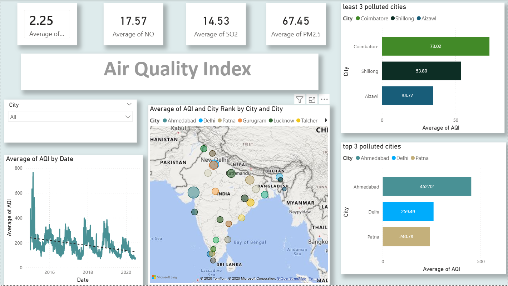

# Air Quality Index Analysis – Power BI

## Project Overview
This Power BI dashboard analyzes Air Quality Index (AQI) data to monitor pollution levels across cities and identify trends over time.

## Objectives
- Monitor AQI levels by city
- Identify most polluted locations
- Analyze pollutant contribution (PM2.5, PM10, NO2, SO2, CO)
- Monthly and yearly AQI trends

## Dataset
- Air Quality dataset containing city-wise AQI values
- Pollutant concentration levels

## 📊 Key Dashboard Features
- AQI KPI indicator
- City-wise AQI comparison
- Pollutant breakdown
- Time-series AQI trend
- Top polluted cities

## 🛠️ Tools & Technologies
- Power BI
- Power Query
- DAX Measures

## 📸 Dashboard Preview

## 📈 Key Insights
- PM2.5 is the major contributor to poor air quality
- Certain cities consistently show high AQI levels
- Seasonal variation observed in pollution levels

## 🚀 How to Use
1. Download the `.pbix` file
2. Open in Power BI Desktop
3. Refresh data if required
